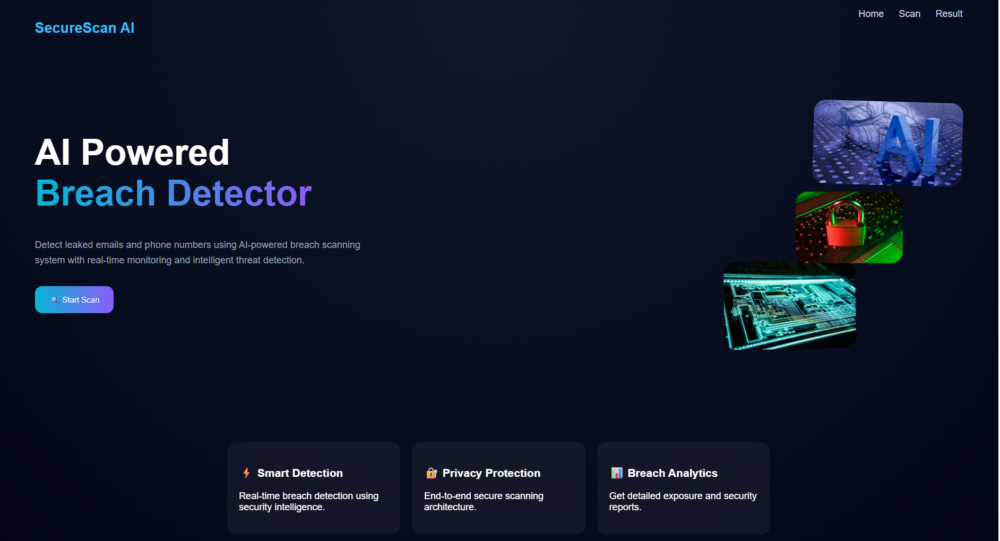
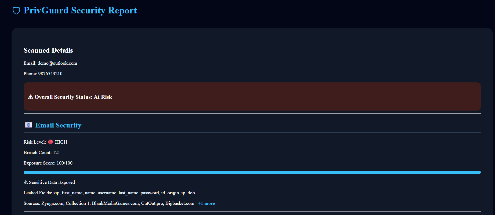

# PrivGuard 🛡️

PrivGuard is a cybersecurity platform that helps users detect whether their email or phone number has been exposed in public data breaches.

## Features

- Email breach detection
- Phone breach detection
- Real-time security scanning
- Risk score analysis
- Exposure report generation
- Loading spinner + progress bar
- Smart breach source display (+more)

## Tech Stack

### Frontend
- React.js
- Vite
- JavaScript
- CSS

### Backend
- Node.js
- Express.js

## Live Demo

Frontend: [Live Website](https://privguard-frontend-d30u.onrender.com)

Backend API: [API Server](https://privguard-backend-7r5j.onrender.com)

## How It Works

1. User enters email or phone number
2. Frontend sends request to backend API
3. Backend scans breach intelligence data
4. Security risk is analyzed
5. User receives a detailed security report

## Future Scope

- Dark web monitoring
- Password strength checker
- Threat prediction
- OTP verification

## Screenshots

### Home Page

### Scan Page

### Security Report

### Additional Report View
.png)
